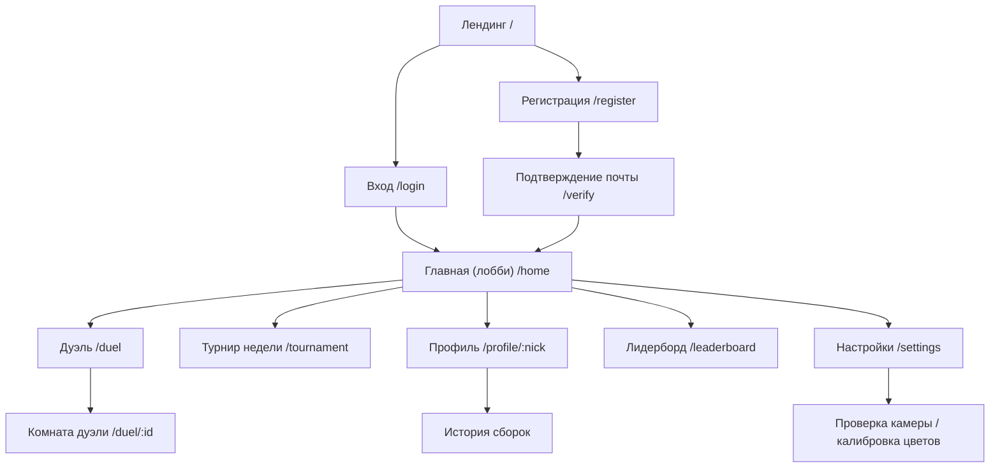
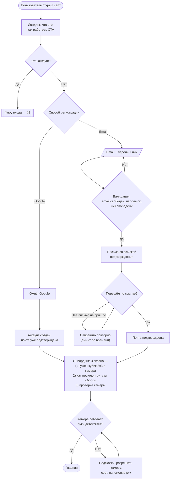
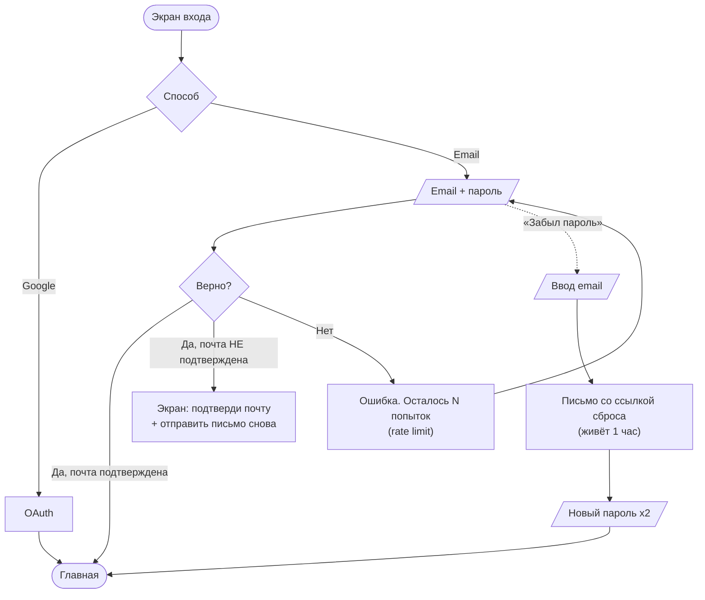
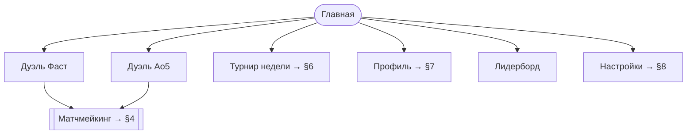
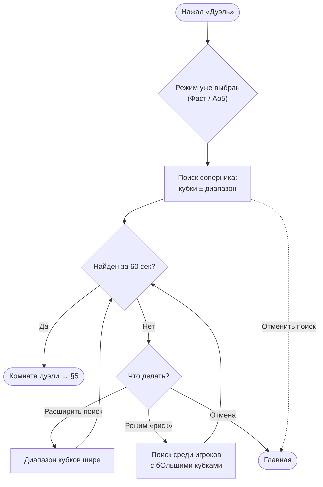
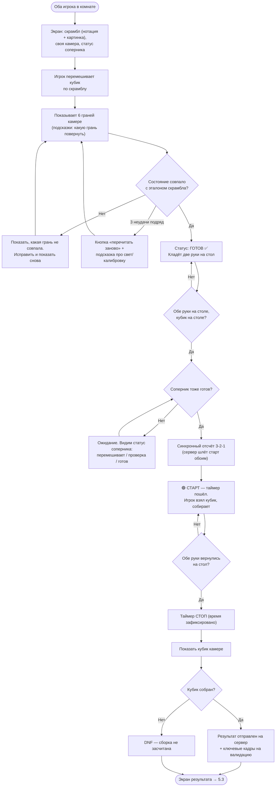
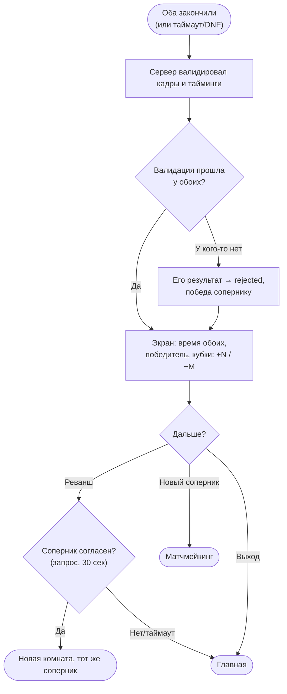
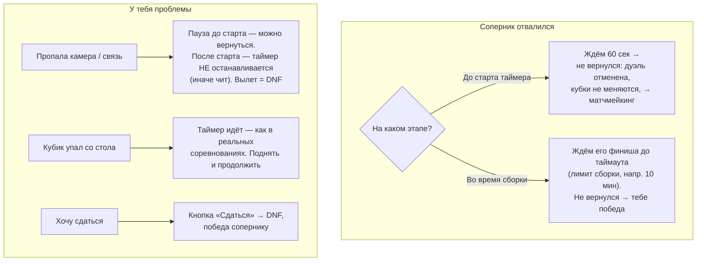
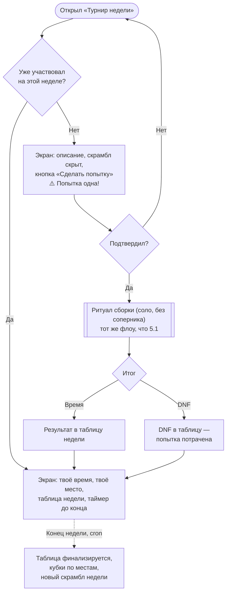

# Cubr — User Flow (MVP)

> Дополнение к [vision.md](../product-overview/vision.md). Все экраны и сценарии пользователя, включая ветки ошибок. Диаграммы в Mermaid — рендерятся на GitHub/GitVerse и в VS Code.

---

## 0. Карта экранов (что вообще есть на сайте)



**Список экранов MVP:**

| # | Экран | Назначение |
|---|---|---|
| 1 | Лендинг | Объяснение проекта + CTA «Играть» |
| 2 | Регистрация | Email+пароль или Google |
| 3 | Подтверждение почты | Ввод/переход по ссылке из письма |
| 4 | Вход | Email+пароль, Google, «забыл пароль» |
| 5 | Восстановление пароля | Email → ссылка → новый пароль |
| 6 | Главная (лобби) | Кнопки режимов, кубки, турнир недели, онлайн-счётчик |
| 7 | Комната дуэли | Весь ритуал сборки + статус соперника |
| 8 | Турнир недели | Скрамбл недели, попытка, таблица |
| 9 | Профиль | Ник, аватар, кубки, рекорды, история |
| 10 | Лидерборд | Топ по кубкам + таблица турнира недели |
| 11 | Настройки | Ник, аватар, пароль, камера/калибровка |

---

## 1. Первый визит и регистрация



**Важно:** онбординг с проверкой камеры обязателен при первом входе — иначе человек попадёт в дуэль и завалит её из-за неработающего зрения. Пропустить можно, но с предупреждением.

---

## 2. Вход и восстановление пароля



---

## 3. Главная (лобби)

Что видит залогиненный игрок:

- **Шапка:** лого, кубки 🏆, аватар → меню (профиль, настройки, выход)
- **Центр:** три большие кнопки — «Дуэль Фаст», «Дуэль Ao5», «Турнир недели»
- **Турнир недели:** статус (участвовал / нет), место в таблице, до конца недели N дней
- **Сбоку:** мини-лидерборд топ-10, счётчик игроков онлайн



---

## 4. Матчмейкинг дуэли



**Правила:**
- Пока идёт поиск — показываем счётчик и кнопку отмены
- «Риск» доступен и сразу: отдельный переключатель до старта поиска
- Оба игрока попадают в комнату одновременно; у обоих один и тот же скрамбл от сервера

---

## 5. Комната дуэли — главный флоу продукта

### 5.1 Полный ритуал (одна сборка)

> **Поправка 1 (утв. фича):** шаг «перемешивает по скрамблу» = по **визуальной
> пошаговой инструкции** (картинки-со-стрелками, по умолчанию) ИЛИ нотации (по
> выбору игрока). Ветка несовпадения при проверке камерой получает выход
> «вернуться к инструкции». См. [feature-scramble-visual](../product-overview/feature-scramble-visual.md).
>
> **Поправка 2 (утв. фича, порядок ритуала):** первым шагом игрок показывает
> **СОБРАННЫЙ** кубик (калибровка/быстрая подстройка по профилю + подтверждение
> честного старта) — ДО выдачи скрамбла. Диаграмма ниже начинается со скрамбла для
> краткости, но канонический порядок: `CALIBRATE_SOLVED → SCRAMBLE_SHOWN →
> SCRAMBLE_VERIFY → READY → SOLVING → STOPPED → SOLVE_VERIFY`.
> См. [feature-cube-profiles](../product-overview/feature-cube-profiles.md).



### 5.2 Режим Ao5

Ритуал 5.1 повторяется 5 раз подряд. Между сборками — пауза до 30 сек («следующий скрамбл»). После пятой: отбрасываем лучшее и худшее, среднее из трёх → результат Ao5. DNF в одной сборке = автоматически «худшее время». Два DNF = DNF всей серии.

### 5.3 Экран результата



### 5.4 Ветки ошибок в дуэли (обязательно обработать!)



---

## 6. Турнир недели



**Правила:** одна попытка в неделю на игрока; скрамбл виден только после подтверждения попытки (иначе можно натренировать); отвал/перезагрузка после показа скрамбла = попытка потрачена (анти-чит).

---

## 7. Профиль

```mermaid
flowchart TD
    A(["Профиль"]) --> B["Ник, аватар, дата регистрации,<br/>кубки 🏆"]
    B --> C["Рекорды: лучший сингл, лучший Ao5"]
    B --> D["Статистика: всего сборок,<br/>дуэлей выиграно/проиграно"]
    B --> E["История сборок: дата, режим,<br/>время, скрамбл, результат дуэли"]
    B --> F{"Чей профиль?"}
    F -->|Мой| G["Кнопка «Настройки»"]
    F -->|Чужой<br/>(клик из лидерборда/дуэли)| H["Просмотр. Кнопка «Вызвать<br/>на дуэль» — V2"]
```

---

## 8. Настройки

| Раздел | Что можно |
|---|---|
| Аккаунт | Сменить ник (лимит: раз в N дней), аватар |
| Безопасность | Сменить пароль, привязать/отвязать Google, выйти со всех устройств |
| Камера | Тест камеры, детект рук, **калибровка цветов кубика** (снять эталон своих 6 цветов при своём освещении) |
| Опасная зона | Удалить аккаунт (подтверждение паролем) |

Калибровка цветов — важный экран: у всех разные кубики и свет; сохранённый цветовой профиль сильно поднимет точность зрения.

---

## 9. Сквозной путь нового игрока (happy path, всё вместе)

```mermaid
flowchart LR
    A(["Пришёл по ссылке"]) --> B["Лендинг"] --> C["Регистрация Google"]
    C --> D["Онбординг + проверка камеры"] --> E["Главная"]
    E --> F["Дуэль Фаст → матчмейкинг"] --> G["Ритуал → сборка → победа 🏆"]
    G --> H["Экран результата: +кубки"] --> I["Турнир недели: попытка"]
    I --> J["Место в таблице"] --> K["Профиль: рекорд записан"]
    K --> L(["Вернётся за реваншем"])
```



---

## 10. Чеклист состояний, которые легко забыть

- [ ] Пустые состояния: история сборок пуста, лидерборд пуст (первая неделя), никого онлайн для матчмейкинга
- [ ] Загрузка/ожидание: поиск соперника, валидация кадров сервером, «соперник ещё собирает»
- [ ] Ошибки сети: WebSocket отвалился и переподключился — восстановить состояние комнаты
- [ ] Камера: доступ запрещён / камеры нет / занята другим приложением
- [ ] Мобильный браузер: минимум — экран «играй с ноутбука/ПК» (камера + кубик + две руки на телефоне неудобно) — решить, поддерживаем ли в MVP
- [ ] Один аккаунт с двух вкладок/устройств одновременно — запретить вторую активную дуэль
- [ ] Rate limits: повторная отправка писем, попытки входа, спам матчмейкингом
