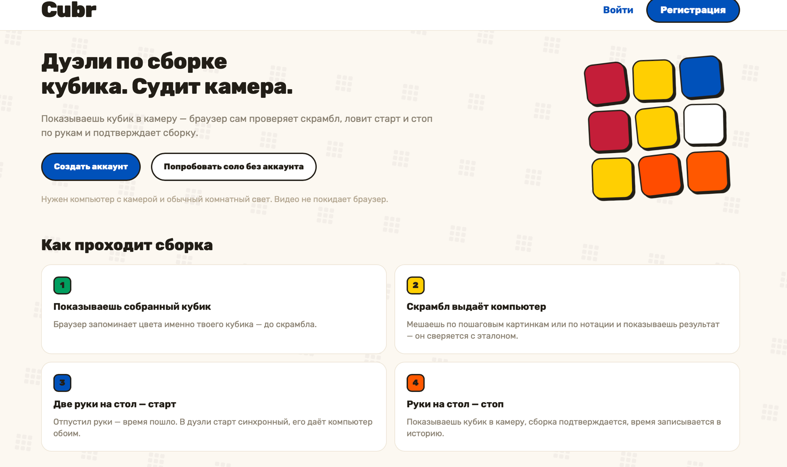
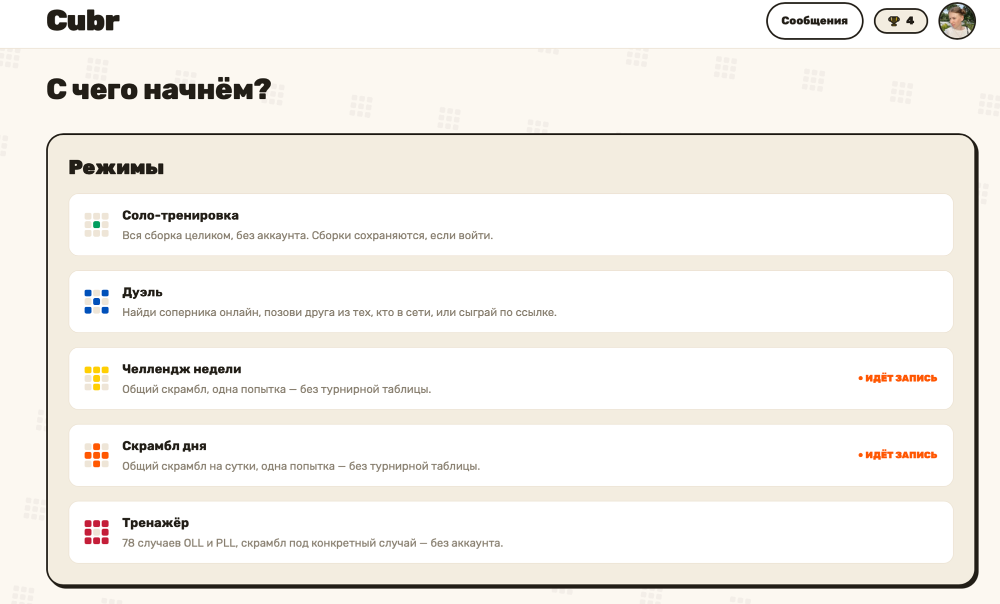
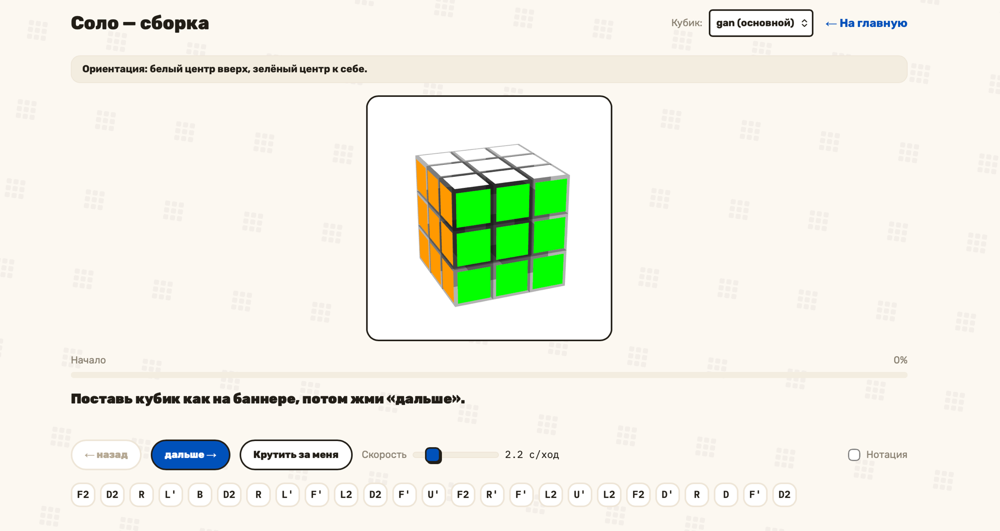
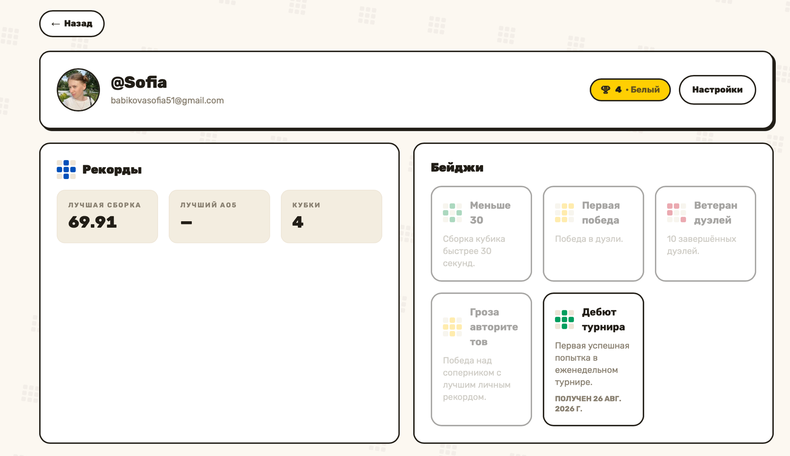

# Cubr

Веб-дуэли по спидкубингу, где судья — компьютерное зрение. Игрок собирает кубик
Рубика перед камерой, браузер по кадрам читает грани и состояние сборки, а
таймер и честность держит сервер. Соло-тренировка, дуэли по ссылке, турниры,
кубки-рейтинг, чат с друзьями.

Продукт и подробное видение — в [`.memory-bank/`](.memory-bank/) (точка входа
[`index.md`](.memory-bank/index.md)).

## Как это выглядит

**Лендинг — правила игры на одном экране**



**Хаб «С чего начнём?» — все режимы одним списком**



**Соло-сборка — скрамбл пошаговыми картинками, с анимацией и нотацией**



**Профиль — рекорды, кубки и бейджи**



## Основные функции

**Судья — камера, а не честное слово.** Браузер сначала запоминает цвета именно
твоего кубика (профили кубиков: у каждого свои наклейки и свой свет), потом
ловит по рукам старт и стоп и сверяет собранное состояние с эталоном. Видео не
уходит с устройства — на сервер летит только результат. Скрамбл выдаёт сервер и
жёстко связывает его с попыткой (scramble↔solve binding), так что «сборку с
удобным скрамблом» не подсунуть.

**Соло-тренировка.** Полная сборка без аккаунта: скрамбл показывается
пошаговыми картинками (или нотацией — переключатель), есть анимация «крутить за
меня» с регулируемой скоростью. Если войти — сборки сохраняются в историю.

**Дуэли.** Матчмейкинг онлайн, вызов друга из тех, кто в сети, или игра по
ссылке без регистрации соперника. Старт синхронный: обратный отсчёт даёт
сервер обоим одновременно, результат обеих сторон судит камера.

**Турнир недели и скрамбл дня.** Общий скрамбл на всех, одна попытка: у
недельного турнира — турнирная таблица и жизненный цикл попытки с финализацией,
у ежедневного — быстрый заход без таблицы.

**Тренажёр.** 78 случаев OLL и PLL, скрамбл генерируется под конкретный
случай. Работает без аккаунта.

**Кубки — рейтинг по мотивам Brawl Stars.** Шесть рангов (белый → жёлтый →
зелёный → синий → оранжевый → красный, пороги 0/100/300/600/1000/1500). Чем
выше ранг, тем меньше дают за победу и больше снимают за поражение; ничья — +2
обоим, победа над неявившимся урезана, повторные дуэли с одним и тем же
соперником в течение суток перестают приносить полные кубки (анти-фарм).

**Профиль и прогресс.** Личные рекорды (лучшая сборка, лучший Ao5), график
времён, стрики, цели sub-N, бейджи за достижения (первая победа, sub-30,
ветеран дуэлей, дебют турнира и другие) и share-карточка результата.

**Друзья и чат.** Поиск и заявки в друзья, список с онлайн-статусом, отдельный
экран сообщений — оттуда же зовут на дуэль.

**Мелочи, которые делают продукт.** Онбординг с калибровкой кубика, письма
через Resend (подтверждение почты, сброс пароля, отписка), фильтр имён,
воронка-аналитика, звуки, локализация RU/EN (ключ = русская строка) и гейт для
мобильных: сборку судит камера ноутбука, и телефону об этом говорят честно.

## Стек

| Слой | Чем |
|---|---|
| Фронтенд | React 19 + TypeScript + Vite + Tailwind v3, Zustand, react-router. Зрение — MediaPipe Hands + собственные модули цвета/состояния кубика на canvas |
| Бэкенд | FastAPI + async SQLAlchemy 2.0 + asyncpg, Postgres 16, миграции Alembic, авторизация fastapi-users, пакетник `uv` (Python 3.12) |
| Прод | Один VPS, три контейнера (Caddy + api + Postgres) в одной сети; фронт — статика, собранная локально; почта через Resend; фоновые задачи — host-cron |

## Структура

```
frontend/     SPA: экраны, зрение, i18n (ключ = русская строка), тесты (vitest)
backend/      API, модели, сервисы, миграции, фоновые джобы, тесты (pytest)
deploy/       docker-compose, Caddyfile, скрипт выкатки
docs/         раннбук деплоя, QA-протоколы, скриншоты
.memory-bank/ база знаний проекта: продукт, тех-детали, конвенции, задачи
swarm-report/ планы и отчёты по фичам (plan → build → review)
prototype/    ранний прототип зрения (Vite+TS)
```

## Локальный запуск

Бэкенд (нужен Docker для Postgres) — подробности в
[`backend/README.md`](backend/README.md):

```bash
cd backend
cp .env.example .env            # заполнить секреты (см. README бэкенда)
docker-compose up -d            # локальный Postgres 16
uv sync
uv run alembic upgrade head
uv run uvicorn app.main:app --reload
```

Фронтенд:

```bash
cd frontend
npm ci
npm run dev
```

## Тесты и проверки

```bash
# бэкенд
cd backend && uv run pytest -q && uv run ruff check . && uv run mypy app
# фронтенд
cd frontend && npx vitest run && npx tsc --noEmit -p tsconfig.app.json && npx eslint . && npm run build
```

CI ([`.github/workflows/ci.yml`](.github/workflows/ci.yml)) гоняет обе стороны и
форматтеры (ruff-format, prettier) на каждый push в `main` и на каждый PR.

## Деплой

Единственный воспроизводимый путь в прод — скрипт, а не ручные правки на сервере
(на сервере нет ни git, ни тулчейна):

```bash
deploy/scripts/deploy.sh
```

Он собирает фронт локально (упавшая сборка останавливает выкатку до касания
прода), шлёт исходники бэкенда, собирает образ, накатывает миграции при живом
старом контейнере, перезапускает API, заливает статику и делает смоук. Полный
раннбук, секреты и cron-задачи — [`docs/deploy.md`](docs/deploy.md).

## Как ведётся разработка

Цикл `/plan → /build → /review` (+ `/debug`) с субагентами по слоям; роутинг —
[`AGENTS.md`](AGENTS.md). Каждая фича проходит через план и полный набор тестов
(Stop-хук блокирует «готово» без прогона). Периодическая сверка — `/pulse`.
